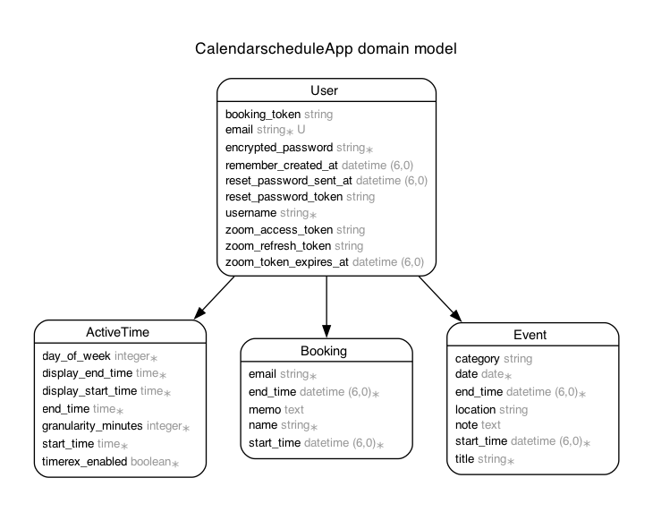

# MySchedule あなたの生活リズムに合わせて予定を把握できるスケジュール管理アプリ

## 1.サービス概要

あなたの生活に合わせて予定を把握できるスケジュール管理アプリ

## 2.サービス画像

## 3.サービスのURL

https://my-schedule-app-871b9c9f089c.herokuapp.com/

## 4.サービスの概要

『MySchedule』は、あなたの生活リズムに合わせて柔軟に予定を管理できるスケジュール管理アプリです。
活動時間を事前に設定することで、「無理のない時間帯」にだけ予定を追加できる仕組みを採用しあなたの生活にコミットしたスケジュール表を作れます。
カレンダーとスケジュールでいつどこにどれぐらいの時間、予定が入っていて空き時間はどこかを視覚的に確認可能でカテゴリーによる色の違いでどのようなものかを一目で判断できturbo/Hotwireによりスムーズに使用できるのが特徴です。

## 5.開発背景

私がこのアプリを作ったのは母の仕事の関係で母の生活リズムに合わせた使いやすいスケジュール管理ツールを作りたいと考えました。
gooleカレンダーのスケジュール機能にTimeRexのマス予約機能を組み合わせたら使いやすいと考え、このアプリを開発しました。

## 6.機能

ホーム画面
  * カレンダービュー: 月間カレンダーで予定がある日をピンアイコンで表示し、日付をクリックするとその日のスケジュールに遷移
  * スケジュールビュー: 活動時間をベースにした時間単位のスケジュール表示。1マス=15分~60分単位で、予定の有無や内容を色とマスで表示。表示されてるマスをクリックすることで予定入力フォームに(日付,開始時間,終了時間)が入力(現在は1マスのみ選択可能。今後は複数マス選択も実装予定)
  * 予定入力フォーム: 予定(タイトル・開始時間・終了時間・場所・メモ・カテゴリー)を入力して記録
  * 予定一覧/編集/削除/詳細 : 予定の一覧/編集/削除/詳細機能を非同期で切り替え可能
活動時間
  * 活動時間編集: 曜日ごとに予定を入れられる時間を設定可能
  * スケジュールの1マスあたりの時間設定: スケジュールで表示させる1マスあたりの時間を(15,30,45,60)の4つから選択可能
ユーザー認証
  * ログイン: 新規登録していただくことであなただけがあなたのデータを確認可能
  * ゲストログイン: どんなものか新規登録せずに確認可能

## 7.使い方
  * 1.まずはホームページにあるログイン、またはゲストログインをしてください。(ゲストログインだとアカウントの削除及び編集はできません)
  * 2.次に活動時間のリンクをクリックしあなたの生活に合った範囲とスケジュールの間隔を設定してみましょう(必須ではなく初期はどの曜日も0:00~23:59になっております)
  * 3.カレンダーで予定を入れたい日付をクリックしてください。するとその日を軸に前後二日分のスケジュールが表示されます。
  * 4.予定を入れたいマスをクリックまたは予定入力フォームに直接入力して作成をしてみましょう。
  * 5.予定が追加されるとカレンダーのその予定の日付にピンアイコンが表示され同時にスケジュールにも予定か表示され可視化されます。
  * 6.予定一覧では(編集/削除/詳細)の三つの機能が使えます。

##　 8.主な使用技術

### フロントエンド
  * HTML / CSS / JavaScript
  * BootStrap (スタイリング)
  * Hotwire（Turbo、Stimulus）（インタラクティブUI）
### バックエンド
  * Ruby 3.3.3
  * Ruby on Rails 7.2.2
  * PostgreSQL（データベース）
### インフラ・開発環境
  * Heroku（デプロイ）
  * Git / GitHub（バージョン管理）
### CI/CD・自動化
  * GitHub Actions（プルリクエスト時の自動テスト実行）
### 使用Gem・ライブラリ
  * Devise（ユーザー認証、ゲストログイン対応）
  * Simple Calendar（月間カレンダー表示）
  * RSpec / FactoryBot / Capybara（テスト）
  * rails-erd (ER図)

## 9.ER図

現在は予定,ユーザー,活動時間の3つのデータベースで構築しております。今後予定、ユーザー,活動時間全てにいくつかカラムを追加する予定です。ER図はrails-erdで生成したものを使用しております。

## 10.今後の展望

### 直近の目標
  * スケジュール画面での複数マス選択機能の実装（JavaScriptによるUI改善）
  * UI調整や予定のcategoryなどの選択肢の強化
  * RSpecのテストの整備（現状はModel・System spec中心。Request specは今後見直し予定）

### 今後の目標
今後はユーザーの生活により密着したスケジュール管理を実現するため、他者との予定共有や柔軟な時間管理機能の拡充に取り組みます。自営業やフリーランスの方にも使いやすいアプリを目指し、以下の機能追加を予定しています。
  * TimeRexのような他人に空き時間を選ばせるスケジューリング機能の導入
  * Zoom API連携しTimeRexのような自動返信機能の実装
  * 現在はMacのフルスクリーンに対応していますが、今後はスマホや様々な画面サイズへの対応も進めていきます

